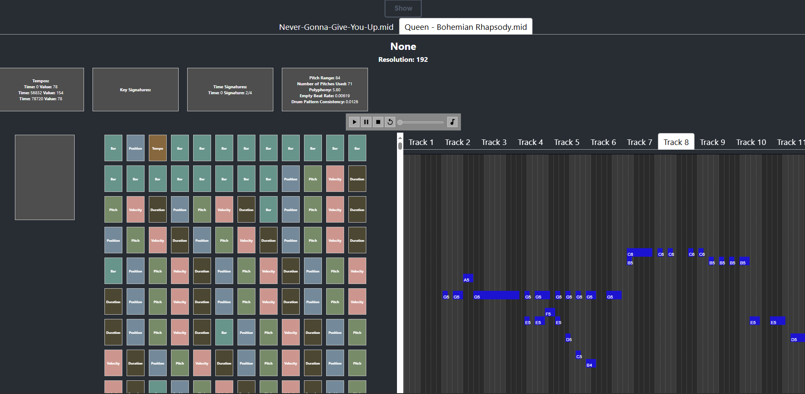

# MidiTok Visualizer

**[ [paper](https://arxiv.org/abs/2410.20518) ] | [ [ISMIR 2024 LBD page](https://ismir2024program.ismir.net/lbd_455.html) ] | [ [example deployment](https://miditok-visualizer-41e761c046c2.herokuapp.com) ]**

MidiTok Visualizer is a web application which allows to visualize MIDI tokenization techniques in a user-friendly way. It mostly includes the tokenizations from [MidiTok](https://github.com/Natooz/MidiTok). It aims to aid research and analysis of symbolic music, especially for researchers new to the field of MIDI processing.

MidiTok Visualizer has been published at the Late Breaking Demos session at ISMIR 2024.



## Key Functionalities

- **Uploading MIDI Files**: Users can upload MIDI files directly from their devices.
- **Tokenizer Selection and Configuration**: The ability to choose a tokenizer and adjust its parameters.
- **Token Overview**: A user-friendly display for reviewing extracted tokens.
- **Symbolic Metrics Overview**: Visualization of symbolic metrics such as key, time signature, and tempo based on the uploaded MIDI file.
- **Enhanced Token Presentation**: Improved readability with token display arranged in rows.
- **Multi-File Support**: Users can upload multiple MIDI files and switch between them seamlessly.
- **Piano Roll Display**: Visualization of the MIDI file in a piano roll format, with separate tracks/programs shown in individual tabs.
- **MIDI Playback**: Ability to play back the uploaded MIDI file.
- **Token Highlighting**: Users can select and highlight tokens, with corresponding notes displayed on the piano roll.
- **Detailed Token Information**: Display of comprehensive token details in an expanded, separate pane.

### Further work (contributors welcome! 😊)

- **Performance Optimization**: Enhancing the application's performance for handling very large MIDI files.
- **Additional Tokenizer Implementations**: Integration of further tokenizers, including MMM, MuMIDI, and REMIPlus.
- **Graphic Design Improvements**: Upgrading the overall visual design of the application.
- **Playback Tracking**: Adding a feature to visually track the current playback position on the piano roll.


## Building and running the app

### Docker Compose

You can run the whole app using `docker compose`:

```sh
docker-compose up --build
```

### Frontend

Basic run:

```sh
cd frontend
npm install
npm run dev
```

Using Docker:

```sh
cd frontend
docker build . -t frontend
docker run frontend -p 3000:3000
```

### Backend

Basic run:

```sh
cd backend
poetry shell
poetry install
python -m core.main
```

or

```sh
poetry run python -m core.main
```

Using Docker:

```sh
cd backend
DOCKER_BUILDKIT=1 docker build --target=runtime . -t backend
docker run backend -p 8000:8000
```

## Testing

### Frontend

Unit tests written with `jest` can be ran with:

```sh
cd frontend
npm install
npm run test
```

### Backend

Unit tests written with `pytest` can be ran with:

```sh
poetry shell
poetry install
pytest
```

or

```
poetry run pytest
```

### Logging

MidiTok Visualizer includes middleware based on `starlette`, which uses `logging` for each request. A single entry contains basic data for a request and the respons, as well as the processing time. The logs are saved to `logfile.log` by default.

## Deployment

You can see an example deployment on Heroku [here](https://miditok-visualizer-41e761c046c2.herokuapp.com)


## Citation

If you find MidiTok Visualizer useful, please consider citing our tool:

```tex
@inproceedings{wiszenko2024miditok,
  title={MidiTok Visualizer: a tool for visualization and analysis of tokenized MIDI symbolic music},
  author={Wiszenko, Micha{\l} and Stefa{\'n}ski, Kacper and Malesa, Piotr and Pokorzy{\'n}ski, {\L}ukasz and Modrzejewski, Mateusz},
  booktitle={Extended Abstracts for the Late-Breaking Demo Session of the 25th International Society for Music Information Retrieval Conference},
  organization={ISMIR},
  year={2024}
}
```


## Contributing

We gladly welcome PRs with enhancements, features and improvements!

We use pre-commit before commiting any changes:

```sh
cd backend
pre-commit run --all-files
```

We use:

- black (formatting)
- ruff (linting)
- isort (import sorting)
- mypy (type checking)

### Maintainers and contributors

- Łukasz Pokorzyński
- Olga Sapiechowska
- Michał Wiszenko
- [Mateusz Modrzejewski](https://mamodrzejewski.github.io)
- Kacper Stefański
- Konstantin Panov
- Piotr Malesa

